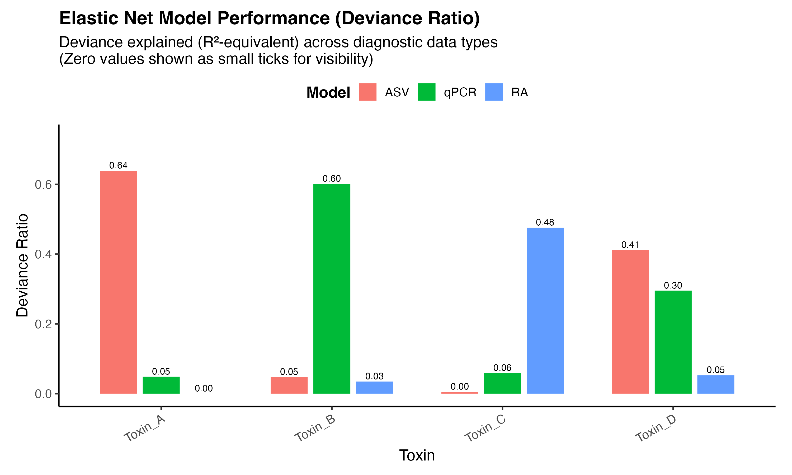

# 📊 Toxin Prediction Using Elastic Net with Grouped Repeated Cross-Validation

## Overview

This repository performs elastic net regression for predicting
mycotoxin/secondary metabolite concentrations for three different
diagnostic assay data types: qPCR, standard NGS, and synthetic spike-in
metabarcoding (SSIM). The objective of this analysis is to understand
which diagnostic method produces the strongest predictive signal for
performing downstream quantitative inference. However, for data
protection and public reproducibility, this repository includes a
biologically structured synthetic dataset that mirrors the original data
structure.

The goals of this project are to:

1)  Perform grouped cross-validation with stable hyperparameter (lambda)
    selection for replicated biological samples
2)  Compare precision (deviance ratio, RMSE) across input datasets
3)  Provide a clean, modular ML workflow in R

## Example Output

<figure>

<figcaption aria-hidden="true">Elastic net model performance (Deviance
ratio)</figcaption>
</figure>

------------------------------------------------------------------------

## Key Features

- Elastic net regression (`glmnet`)
- Repeated cross-validation (lambda selection)
- Grouped folds to prevent replicate leakage
- Parallelization across outcomes
- Synthetic dataset generator
- Summary tables and figures

------------------------------------------------------------------------

## Data Structure

The dataset follows a replicated biological design where each biological
sample has 3 technical replicates

- For example, sample IDs are structured as follows:

      1_1
      1_2
      1_3
      2_1
      2_2
      2_3
      ...

- Cross-validation folds are assigned so each set of biological
  replicates is assigned either to the training set or test set (i.e. no
  replicate leakage).

------------------------------------------------------------------------

## Feature Sets Compared

The pipeline is trained on three seperate datasets:

1.  **ASVs** (Spike-in normalized data from SSIM pipeline)
2.  **qPCR** (From 8 single-species qPCR primers)
3.  **Relative abundance** (un-normalized data from SSIM pipeline,
    expressed as ASV reads/total sample reads)

This allows for a structured comparison of model fit across different
diagnostic methods for secondary metabolite production

------------------------------------------------------------------------

## Modeling Strategy

For each toxin:

1.  Log-transform response:

        y = log(toxin + 1)

2.  Perform repeated grouped cross-validation:

    - `n_runs` repetitions
    - `n_folds` folds
    - Replicates kept together

3.  Collect lambda.min from each run

4.  Select final lambda as the **median lambda across runs**

5.  Refit elastic net on the complete dataset at the median lambda value

6.  Compute:

    - In-sample deviance ratio (`dev.ratio`)
    - RMSE distribution across repeated runs

------------------------------------------------------------------------

## Why Median Lambda?

Repeated CV can produce variability in lambda selection. Using the
median lambda across repeated runs stabilizes hyperparameter choice and
reduces sensitivity to outliers from a random fold split.

------------------------------------------------------------------------

## Performance Metrics

- **Deviance Ratio (dev.ratio)** Same as R² in Gaussian models.

- **RMSE** Computed on full data at optimal, CV-selected lambda.
  Repeated runs provide uncertainty intervals.

------------------------------------------------------------------------

### Running the Pipeline

This project is intended to run from a fresh R session.

### Install required packages

``` r
install.packages(c("glmnet", "foreach", "doParallel", "ggplot2", "dplyr"))
```

### Step 1: Generate Synthetic Data

``` r
source("data-raw/01_generate_synthetic_data.R")
```

    ## Wrote synthetic inputs to ./data/

### Step 2: Run Full Pipeline

``` r
source("analysis/00_run_all.R")
```

Outputs will be written to:

    outputs/tables/
    outputs/figures/

------------------------------------------------------------------------

## Demo vs Full Mode

The modeling script supports adjustable repetition counts.

For GitHub demonstration:

``` r
n_runs <- 25
```

For research-grade stability:

``` r
n_runs <- 500
```

------------------------------------------------------------------------

## Repository Structure

    analysis/
      00_run_all.R
      01_load_data.R
      02_preprocess.R
      03_fit_models.R
      04_summarize_results.R
      05_make_figures.R

    data-raw/
      01_generate_synthetic_data.R

    R/
      config.R

    outputs/

------------------------------------------------------------------------

## Related Work

The Synthetic Spike-In Metabarcoding (SSIM) methodology underlying this
project is described in:

3.  Oppenheimer, P., Tini, F., Whetten, R., Laraba, I., Read, Q.,
    Whitaker, B., Vaughan, M., Beccari, G., Covarelli, L., and
    Cowger, C. (2025). Synthetic spike-in metabarcoding for plant
    pathogen diagnostics results in precise quantification of copy
    number within the genus Fusarium. ISME Communications, 5(1).
    <https://doi.org/10.1093/ismeco/ycaf124>
